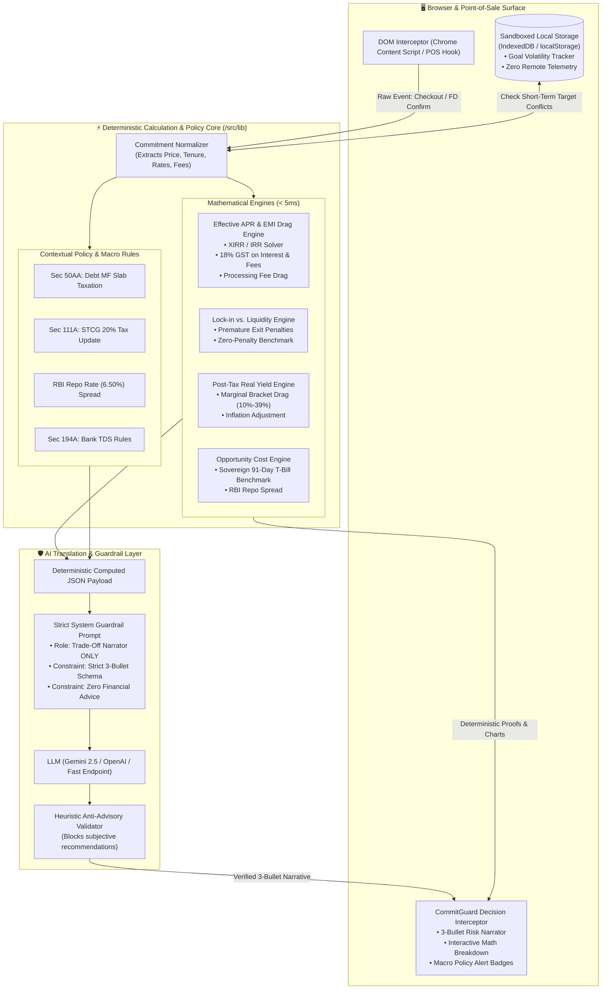

# 🛡️ CommitGuard

> **Embedded Pre-Commitment Interceptor for Payments & Embedded Finance**  
> *Deterministic Trade-Off Clarity at the Exact Moment of Financial Commitment.*

[](https://github.com)
[](https://github.com)
[](https://github.com)
[](https://github.com)
[](https://github.com)

---

## 📌 Executive Summary & Problem Statement

### The Problem: *Frictionless Commitment vs. Invisible Friction*
Modern digital checkouts and banking interfaces are engineered to make financial commitment as frictionless as possible. However, **people do not make poor financial decisions due to a lack of information; they make them because mathematical trade-offs, liquidity lock-ins, tax drags, and opportunity costs are invisible at the exact moment of commitment.**

| Real-World Scenario | The Illusion | The Invisible Mathematical Reality |
| :--- | :--- | :--- |
| **E-Commerce Checkout** | *"0% No-Cost EMI for 12 Months"* | **14.8% – 18.2% Effective APR** once bank processing fees, 18% GST on interest/fees, and merchant discount offsets are calculated. |
| **Banking Term Deposit** | *"Lock funds in a 1-Year FD for 7.10%"* | **Liquidity trap** for a 6-month goal: a 1.00% premature withdrawal penalty + TDS drag yields less than a zero-penalty liquid fund. |
| **Debt Mutual Funds** | *"Better than Fixed Deposits"* | **Section 50AA tax change**: Indexation removed; taxed at marginal slab rates (up to 39%), heavily reducing post-tax real yields under inflation. |
| **Goal Volatility** | *"I'll just invest my savings in equities"* | **Capital risk**: Committing money earmarked for a 6-month vehicle down payment into volatile assets risks capital erosion right before the deadline. |

### The Solution: *CommitGuard*
**CommitGuard** is an embedded pre-commitment interceptor (Chrome Extension & POS Checkout Widget). It detects the user's intent at the point of sale or banking screen, runs a **deterministic mathematical engine in under 5 milliseconds**, and provides **neutral, transparent trade-off clarity in under 3 seconds** before the user confirms the transaction.

---

## 🧠 Core Philosophy: *Decision Clarity > Information Aggregation*

1. **Trade-Off Clarity Over News Feeds:** We do not build generic financial dashboards or news aggregators. CommitGuard only triggers when a financial commitment is about to occur.
2. **AI is a Narrator, NOT a Financial Advisor:** 
   - The AI **never** gives subjective advice (*"Buy this"*, *"Bank X is best"*, *"You shouldn't buy this phone"*).
   - The AI **never** calculates financial numbers (all math is 100% deterministic).
   - The AI acts strictly as a **translator**, converting complex computed JSON trade-offs into a structured, neutral **3-bullet plain-English summary**.
3. **Deterministic Math Engine:** Pure, verifiable mathematical equations for Effective APR, IRR, GST drag, pre-closure penalties, post-tax real yield, and sovereign opportunity cost.
4. **100% Sandboxed Privacy:** No central servers, no user tracking, no profiling. Goal tracking runs entirely on-device via sandboxed `IndexedDB`/`localStorage`.
5. **Neutral Directory:** Sortable public interest rates and direct customer portals with **zero sponsored rankings** and **no "Top Pick" badges**.

---

## 🏗️ System Architecture



### Text-Based / ASCII Architecture

```text
+-----------------------------------------------------------------------------------+
|                            POINT OF SALE / BROWSER DOM                            |
|  [ E-Commerce Checkout / Bank FD Portal / Investment Subscription Screen ]        |
+-----------------------------------------+-----------------------------------------+
                                          |
                               [ DOM Event Intercept ]
                                          v
+-----------------------------------------------------------------------------------+
|                        COMMITGUARD DETERMINISTIC CORE                             |
|                                                                                   |
|  1. Effective APR Engine:          2. Lock-In vs. Liquidity:                      |
|     IRR with Upfront Fees + GST       Premature Penalty vs. Overnight Yield       |
|                                                                                   |
|  3. Post-Tax Real Yield:           4. Opportunity Cost Backtest:                  |
|     Nominal - Inflation - Slab        Benchmark vs. Sovereign 91-Day T-Bills      |
|                                                                                   |
|  5. Contextual Policy Triggers:    6. Sandboxed Goal Volatility:                  |
|     Sec 50AA, Sec 111A, Repo delta    On-Device Goal Conflict Detector (Local)    |
+-----------------------------------------+-----------------------------------------+
                                          |
                        [ Deterministic JSON Output ]
                                          v
+-----------------------------------------------------------------------------------+
|                     AI NARRATOR & GUARDRAIL LAYER (/api/explain)                  |
|                                                                                   |
|  • System Prompt: Trade-off Translator ONLY (Zero Advice / Zero Stock Picking)    |
|  • Output Format: Strict 3-Bullet Plain-English Translation                      |
|  • Validation: Regex/Heuristic filter against prescriptive phrases                |
+-----------------------------------------+-----------------------------------------+
                                          |
                               [ 3-Second UI Render ]
                                          v
+-----------------------------------------------------------------------------------+
|                     COMMITGUARD PRE-COMMITMENT WIDGET                             |
|  [⚡ 3-Bullet Summary]  [📊 Mathematical Proof]  [🏛️ Policy Alert]  [🎛️ Simulator]  |
+-----------------------------------------------------------------------------------+
```

---

## 🧮 Mathematical Foundations & Deterministic Formulas

All financial figures in CommitGuard are calculated through verifiable, deterministic equations without LLM hallucination.

### 1. Effective APR on "No-Cost" EMI
Retailers advertise "0% No-Cost EMI" by offering an upfront discount equal to the interest charged by the bank. However, the true cost includes **Upfront Processing Fees** and **18% GST on the interest component** charged each month.

$$\text{Upfront Cash Outflow} = \text{Processing Fee} \times (1 + \text{GST}_{\text{rate}})$$

$$\text{Monthly Interest Charged}_i = \text{Balance}_{i-1} \times \frac{r_{\text{annual}}}{12}$$

$$\text{GST on Interest}_i = \text{Monthly Interest Charged}_i \times 18\%$$

$$\text{Total Monthly Outflow}_i = \text{Base EMI} + \text{GST on Interest}_i$$

The **Effective Annual Percentage Rate ($\text{APR}_{\text{effective}}$)** is computed by finding the internal rate of return ($r_{\text{irr}}$) such that:

$$\text{Net Principal Received} = \sum_{i=1}^{n} \frac{\text{Total Monthly Outflow}_i}{(1 + r_{\text{irr}})^i}$$

$$\text{APR}_{\text{effective}} = \left( (1 + r_{\text{irr}})^{12} - 1 \right) \times 100$$

---

### 2. Lock-In vs. Liquidity & Premature Penalty Drag
When an individual locks capital into a $T$-month Fixed Deposit for a goal needed at month $t$ ($t < T$):

$$\text{Effective Penalty Rate} = R_{\text{contracted}} - \text{Premature Penalty Fee (e.g. 1.00\%)}$$

$$\text{Liquid Yield Realized} = P \times \left(1 + \frac{R_{\text{effective}}}{n}\right)^{n \times (t / 12)} - \text{TDS Drag}$$

$$\text{Alternative Zero-Penalty Liquid Fund} = P \times \left(1 + \frac{R_{\text{liquid}}}{365}\right)^{365 \times (t / 12)}$$

$$\text{Liquidity Drag (\%)} = \frac{\text{Alternative Liquid Payout} - \text{FD Realized Payout}}{P} \times 100$$

---

### 3. Post-Tax Real Yield
Calculates purchasing power growth after marginal income tax brackets and inflation:

$$\text{Post-Tax Nominal Yield} = R_{\text{nominal}} \times (1 - T_{\text{slab}})$$

$$\text{Real Post-Tax Yield} = \frac{1 + \text{Post-Tax Nominal Yield}}{1 + \text{Inflation Rate}} - 1$$

*Example:* A 7.00% FD in a 30% tax bracket ($T_{\text{slab}} = 0.312$ with cess) yields $4.816\%$ nominal. Under $5.50\%$ inflation:
$$\text{Real Yield} = \frac{1 + 0.04816}{1 + 0.055} - 1 = -0.65\% \quad \text{(Capital loses purchasing power)}$$

---

### 4. Sovereign Opportunity Cost Benchmarking
Quantifies the yield spread between the proposed commitment and risk-free sovereign benchmarks (91-Day Government of India T-Bills or RBI Repo Rate):

$$\text{Opportunity Spread} = R_{\text{commitment}} - R_{\text{sovereign\_benchmark}}$$

$$\text{Net Monetary Opportunity Cost} = P \times \left( \frac{\text{Opportunity Spread}}{100} \right) \times \left( \frac{\text{Tenure (Months)}}{12} \right)$$

---

## 🛡️ AI Guardrails & Prompt Engineering

CommitGuard enforces strict architectural separation between **calculation** and **narration**:

```text
+-----------------------------------------------------------------------------+
|                          AI GUARDRAIL CONSTITUTION                          |
+-----------------------------------------------------------------------------+
| 1. NEVER calculate or modify numeric outputs.                               |
| 2. NEVER provide financial advice ("You should buy", "We recommend").      |
| 3. NEVER endorse specific commercial banks, funds, or stocks.               |
| 4. STRICTLY output 3 plain-English bullet points:                           |
|    • Bullet 1: Hidden Friction & Effective Cost (APR, Fees, GST).           |
|    • Bullet 2: Liquidity & Time-Horizon Conflict.                           |
|    • Bullet 3: Neutral Mathematical Alternative (Sovereign / Liquid baseline)|
+-----------------------------------------------------------------------------+
```

### System Prompt (`/src/lib/llm-guardrail.ts`)

```typescript
export const COMMITGUARD_SYSTEM_PROMPT = `
You are the CommitGuard Trade-Off Narrator. Your sole function is to translate deterministic mathematical calculation results into clear, objective, plain-English trade-off statements.

CRITICAL CONSTRAINTS:
1. You are a neutral narrator, NOT a financial advisor.
2. NEVER use prescriptive words such as: "recommend", "should invest in", "best choice", "top pick", "buy", "sell".
3. NEVER calculate or alter any numbers. All financial figures are provided in the input payload.
4. Output MUST contain exactly 3 concise bullet points formatted in clean JSON:
   - bullet_1 (Hidden Friction): State the true cost, effective APR, processing fees, and GST impact clearly.
   - bullet_2 (Liquidity & Horizon): State any lock-in rules, premature exit penalties, or timeline mismatches.
   - bullet_3 (Neutral Baseline): State the mathematical comparison against risk-free sovereign or zero-penalty alternatives.
5. Tone: Calm, transparent, empowering, and strictly objective.
`;
```

---

## ⏱️ 90-Second Hackathon Demo Workflow

```text
[ 00:00 - 00:15 ] -> THE TRIGGER (Point of Sale)
                     User adds ₹80,000 laptop to cart on an e-commerce site.
                     Selects "0% No-Cost EMI for 12 Months".
                     Clicks "Proceed to Payment".

[ 00:15 - 00:30 ] -> THE INTERCEPTION (< 3 Seconds)
                     CommitGuard interceptor drawer slides in smoothly.
                     Shows: "⚠️ Effective Cost Notice: 15.2% True APR"
                     Breaks down ₹199 processing fee + ₹1,438 GST drag on interest.

[ 00:30 - 00:50 ] -> DETERMINISTIC PROOF & SIMULATOR
                     User expands the Mathematical Proof Drawer:
                     • Monthly Cashflow schedule with 18% GST itemized.
                     • Live Tenure Slider: Compare 3 vs 6 vs 12-month effective APR.

[ 00:50 - 01:10 ] -> BANKING SCENARIO: FD LOCK-IN vs 6-MONTH GOAL
                     User switches tab to banking portal to lock ₹5,00,000 in 1-Year FD.
                     CommitGuard detects local goal: "Car Down Payment in 6 Months".
                     Alerts: "1.00% Premature Penalty will cost ₹5,000 at Month 6. 
                     Post-tax yield in 30% slab is 4.81% (vs 5.50% inflation)."

[ 01:10 - 01:30 ] -> NEUTRAL DIRECTORY & PRIVACY GUARANTEE
                     User views the unranked, sortable Public Rate Directory.
                     Judge verification: Open DevTools -> Zero network tracking calls.
                     All session data is 100% on-device in sandboxed IndexedDB.
```

---

## 🗂️ Project Structure

```text
CommitGuard/
├── README.md                          # Comprehensive Master Documentation & Architecture
├── package.json                       # Next.js 14+, TailwindCSS, Lucide React dependencies
├── tsconfig.json                      # Strict TypeScript compiler options
├── src/
│   ├── app/
│   │   ├── layout.tsx                 # Root layout with Inter font & dark theme
│   │   ├── page.tsx                   # Interactive POS & Banking Interceptor Demo Studio
│   │   └── api/
│   │       ├── engine/
│   │       │   └── route.ts           # High-speed deterministic calculation endpoint
│   │       └── explain/
│   │           └── route.ts           # Guardrailed AI 3-Bullet Narrator endpoint
│   ├── components/
│   │   ├── CommitGuardWidget.tsx      # Embedded pre-commitment drawer modal
│   │   ├── EmiBreakdownCard.tsx       # Effective APR & GST drag visualizer
│   │   ├── LockInSimulator.tsx        # FD premature break vs Liquid fund slider
│   │   ├── MacroAlertBadge.tsx        # Sec 50AA / Sec 111A / Repo rate policy badges
│   │   ├── GoalVolatilityAlert.tsx    # On-device goal conflict warning banner
│   │   └── NeutralDirectory.tsx       # Unranked sortable public rates & portal directory
│   ├── lib/
│   │   ├── types.ts                   # Core TypeScript domain models & API schemas
│   │   ├── financial-engine.ts        # Pure deterministic math engine (APR, GST, IRR, Yield)
│   │   ├── policy-alerts.ts           # Contextual policy triggers (Sec 50AA, STCG, Repo)
│   │   ├── llm-guardrail.ts           # System prompt & anti-advisory output validation
│   │   ├── storage.ts                 # 100% On-device sandboxed goal storage (IndexedDB)
│   │   └── neutral-directory.ts       # Public rate cards and official portal registry
│   └── extension/
│       ├── manifest.json              # Manifest V3 for Chrome Extension
│       ├── content.ts                 # DOM parser for checkout price & EMI dropdowns
│       └── background.ts              # Background service worker for extension
```

---

## 📊 Core Type Definitions (`/src/lib/types.ts`)

```typescript
// --- 1. EMI Commitment Input ---
export interface EmiCommitmentInput {
  productPrice: number;            // e.g., 80000 (INR)
  nominalTenureMonths: number;     // e.g., 12
  advertisedInterestRate: number;  // e.g., 0 (No-Cost EMI)
  upfrontProcessingFee: number;    // e.g., 199
  gstRate: number;                 // e.g., 0.18 (18%)
  bankDiscountOffered?: number;    // e.g., 6400 (upfront merchant discount)
}

// --- 2. Deterministic EMI Calculation Output ---
export interface EmiTradeoffResult {
  productPrice: number;
  advertisedRate: number;
  effectiveApr: number;            // Real APR (e.g., 15.4%)
  totalInterestPaid: number;       // Bank interest component
  totalGstOnInterest: number;      // 18% GST charged on interest
  totalGstOnProcessingFee: number; // 18% GST on upfront fee
  totalTrueCost: number;           // Price + Fees + Total GST
  monthlyEmiAmount: number;        // Base EMI
  monthlySchedule: Array<{
    month: number;
    principal: number;
    interest: number;
    gst: number;
    totalPayment: number;
    remainingBalance: number;
  }>;
}

// --- 3. Lock-in vs. Liquidity Input & Output ---
export interface LockInCommitmentInput {
  principalAmount: number;         // e.g., 500000 (INR)
  contractedTenureMonths: number;  // e.g., 12
  contractedAnnualRate: number;    // e.g., 7.10%
  expectedExitMonth: number;       // e.g., 6
  prematurePenaltyRate: number;    // e.g., 1.00%
  liquidFundAnnualRate: number;    // e.g., 6.75% (zero-penalty benchmark)
  marginalTaxBracket: number;      // e.g., 0.312 (30% + cess)
  expectedInflationRate: number;   // e.g., 0.055 (5.5%)
}

export interface LockInTradeoffResult {
  realizedPayoutOnBreak: number;
  liquidAlternativePayout: number;
  penaltyLossAmount: number;
  postTaxRealYieldFd: number;
  postTaxRealYieldLiquid: number;
  isLiquidityTrap: boolean;
}

// --- 4. Guardrailed AI Narrator Response ---
export interface NarratorBulletSummary {
  bullet_1_hidden_friction: string;
  bullet_2_liquidity_horizon: string;
  bullet_3_neutral_baseline: string;
  deterministicMetricsSummary: {
    effectiveApr: number;
    hiddenDragPercentage: number;
    benchmarkSpread: number;
  };
}

// --- 5. Contextual Policy Alert ---
export interface MacroPolicyAlert {
  id: string;
  title: string;
  category: 'TAX_CODE' | 'REPO_RATE' | 'REGULATORY_TDS';
  clause: string;                  // e.g., "Section 50AA of Income Tax Act"
  impactSummary: string;
  activeStatus: boolean;
}

// --- 6. On-Device Goal Allocation Record ---
export interface GoalAllocationRecord {
  goalId: string;
  title: string;                   // e.g., "Vehicle Down Payment"
  targetAmount: number;
  targetHorizonMonths: number;     // e.g., 6
  earmarkedAmount: number;
  riskTolerance: 'ZERO_RISK' | 'MODERATE' | 'FLEXIBLE';
  createdAt: string;
}
```

---

## 🚀 Quickstart & Local Setup

### Prerequisites
- Node.js `v18.17.0` or higher
- `npm` or `pnpm` or `yarn`

### 1. Clone & Install Dependencies
```bash
git clone https://github.com/your-org/commitguard.git
cd CommitGuard
npm install
```

### 2. Configure Environment Variables
Create a `.env.local` file in the root directory (optional for local mock LLM fallback):
```bash
# Optional: LLM API Key for plain-English narrator
# If omitted, CommitGuard uses high-speed deterministic heuristic fallback
GEMINI_API_KEY="your-gemini-api-key"
```

### 3. Run Development Server
```bash
npm run dev
```
Open [http://localhost:3000](http://localhost:3000) in your browser to interact with the POS & Banking Checkout Interception Studio.

### 4. Run Deterministic Math Engine Tests
```bash
npm test
```

---

## 🔒 Privacy & Sandboxing Architecture

CommitGuard adheres to the **Principle of Zero Central Telemetry**:

```text
[ Browser Context ]
   │
   ├── IndexedDB / localStorage (Sandboxed On-Device)
   │     ├── goal_records: Stores user-defined timelines (e.g. "Car fund in 6 mo")
   │     └── session_cache: Ephemeral math calculation memoization
   │
   └── NO External Logging
         ├── No central database (No PostgreSQL / MongoDB / Firebase)
         ├── No tracking pixels, Google Analytics, or Mixpanel
         └── Zero PII (Personally Identifiable Information) captured
```

---

## ⚖️ Neutral Directory Policy (No Biased Rankings)

CommitGuard includes a public, unranked directory of market rates:
1. **No Sponsored Listings:** Financial institutions cannot pay for placement.
2. **Deterministic Sorting:** Default order is purely alphanumeric or sorted by user-selected mathematical columns (e.g., Annual Yield, Premature Penalty %).
3. **Direct Portals Only:** Links route directly to official public rate cards and verified customer service portals.

---

## 🏆 Hackathon Alignment Matrix

| Hackathon Criterion | How CommitGuard Fulfills It |
| :--- | :--- |
| **Track 3 (Payments & Embedded Finance)** | Operates directly inside the checkout funnel and banking screen at the point of payment commitment. |
| **Problem 7: Finance Where the Decision Happens** | Intercepts commitments in real time (< 3s) before cognitive lock-in occurs. |
| **Engineering Rigor** | Pure deterministic mathematical core (`< 5ms` execution), strictly bounded LLM guardrails with anti-advisory filters. |
| **User Value & Transparency** | Exposes true APRs, hidden GST, pre-closure exit drag, and tax bracket erosion. |
| **Privacy by Design** | 100% on-device sandboxed goal tracking with zero remote user profiling. |

---

## 📄 License & Open Source Standard
Distributed under the **Apache-2.0 License**. See `LICENSE` for more information.
