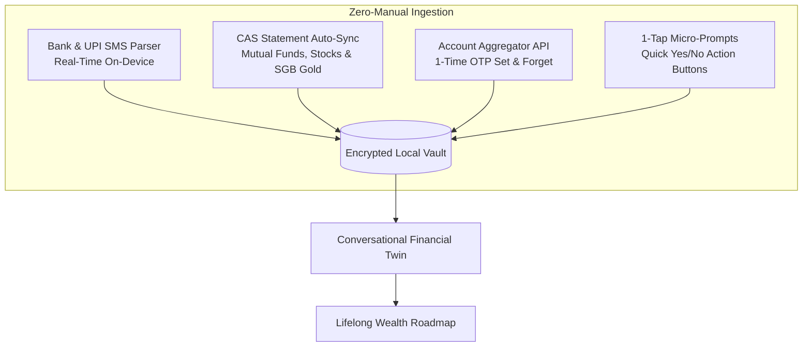
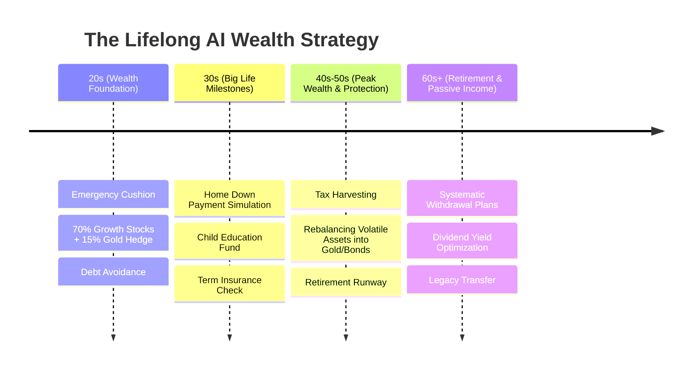

# ⚡ Zero-Effort Automation & Lifelong Financial Journey Blueprint
> **Project:** AI-Powered Wealth Mentor & Multi-Asset Intelligence  
> **Document Purpose:** Complete specification of the Zero-Manual-Entry tracking engine and the lifelong adaptive financial lifecycle.

---

## 1. The Core Problem: The "3-Day Churn Trap"

```
[Day 1-3: High Motivation]  ───>  [Day 4-7: Typing Fatigue]  ───>  [Day 8+: App Abandoned]
  Users manually log coffee,       Manual entry feels like a       95% of users quit because
  groceries, and rent.             second job.                     manual tracking is tedious.
```

**The Core Principle:** A financial app that requires manual data entry is doomed to fail. To help someone for their entire life, tracking must be **100% invisible, automatic, and frictionless**.

---

## 2. The 4 Zero-Manual-Effort Ingestion Engines



### Engine 1: On-Device SMS & Notification Parser (Real-Time)
- **How it works:** When a debit card is swiped, UPI payment is made, or salary is deposited, the bank sends an instant notification.
- **Zero-Effort Behavior:** The app's background worker parses the SMS on-device:
  - *Incoming SMS:* `"INR 450 debited at Grocery Mart on 18-Aug"`
  - *Automated Action:* Instantly logged under `Essentials / Groceries`. **User does not open the app.**

### Engine 2: Consolidated Account Statement (CAS) Auto-Sync
- **How it works:** Investment depositories (CAMS, KFintech, CDSL/NSDL) generate monthly consolidated portfolios.
- **Zero-Effort Behavior:** Drop in the single monthly CAS statement PDF &rarr; The app parses all Mutual Funds, Equities, Sovereign Gold Bonds (SGB), and ETFs in 1 second.

### Engine 3: Account Aggregator (AA) & Open Banking
- **How it works:** A 1-time government-backed digital consent framework.
- **Zero-Effort Behavior:** Automatically updates verified bank balances, deposits, and fixed savings in the background without fragile login screens.

### Engine 4: 1-Tap Micro-Actions (No Forms, Just 1 Tap)
- **How it works:** Instead of forcing users to build spreadsheets, the AI presents actionable micro-decisions via push notifications:
  > *"Hey! You have $120 unspent from your weekend allowance. Want to auto-allocate $50 into Digital Gold?"*  
  > **[ 🟢 Yes, Save $50 ]** &nbsp;&nbsp;&nbsp;&nbsp; **[ ⚪ Skip ]**

---

## 3. The Lifelong Financial Journey Roadmap (Age 20 to 60+)

The AI automatically evolves its coaching strategy as the user transitions across life stages:



### Phase 1: In Your 20s (Foundation & Wealth Accumulation)
* **AI Focus:** Building a 3–6 month emergency buffer, avoiding high-interest credit card traps, and setting up disciplined monthly DCA (Dollar-Cost Averaging) into **Gold & Growth Equities**.
* **Key Metric:** Savings Rate (% of income saved before spending).

### Phase 2: In Your 30s (Major Life Milestones)
* **AI Focus:** Simulating down payments for home purchases, planning for marriage or family, and running life insurance stress tests.
* **Key Metric:** Goal Timeline Feasibility (e.g., *"On track to buy a home by age 34"*).

### Phase 3: In Your 40s–50s (Wealth Protection & Peak Earning)
* **AI Focus:** Rebalancing out of speculative assets into stable hedges (Physical Gold, Sovereign Bonds, Blue-Chips) and optimizing tax deductions.
* **Key Metric:** Gold-to-Equity Inflation Resilience Ratio.

### Phase 4: In Your 60s+ (Retirement & Passive Cash Flow)
* **AI Focus:** Designing Systematic Withdrawal Plans (SWP) and dividend payout strategies so the user never runs out of cash.
* **Key Metric:** Monthly Passive Cash Flow vs. Living Expenses.

---

## 4. Why This Creates an Unbeatable Product Moat

| Traditional Apps (Mint/YNAB) | Our Automated Wealth Mentor |
| :--- | :--- |
| Requires manual entry every single day. | **Zero manual entry** via SMS, CAS, and 1-tap prompts. |
| Drops users when they miss 3 days of typing. | **Continuously runs in the background** for life. |
| Ignores Gold, Cash, and physical wealth. | **First-class Multi-Asset tracking (Gold, Stocks, Cash).** |
| Static monthly budget rules. | **Evolves automatically across your 20s, 30s, 40s, and 60s.** |
