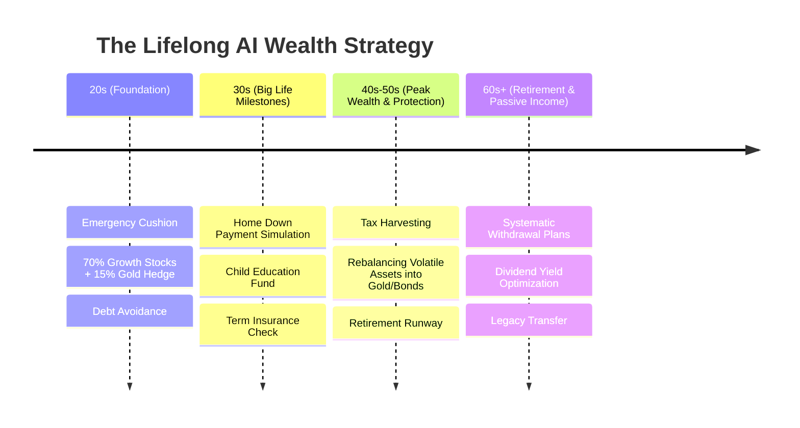

# 📜 Complete Discussion & Brainstorming Session Transcript
> **Project:** AI-Powered Wealth Mentor & Multi-Asset Intelligence  
> **Repository:** [Anshhh0306/Finance](https://github.com/Anshhh0306/Finance)  
> **Date:** August 19, 2026  
> **Purpose:** Permanent comprehensive archive of all discussions, Q&As, grilling sessions, market research, and technical decisions made during this session.

---

## Table of Contents
1. [Phase 1: Git & GitHub Collaboration Setup](#1-phase-1-git--github-collaboration-setup)
2. [Phase 2: The Core Vision & Grill-Me Deep Dive](#2-phase-2-the-core-vision--grill-me-deep-dive)
3. [Phase 3: The 4 Core Pillars (Competitive Moat)](#3-phase-3-the-4-core-pillars-competitive-moat)
4. [Phase 4: Real-World Market Gaps from Reddit & Online Research](#4-phase-4-real-world-market-gaps-from-reddit--online-research)
5. [Phase 5: The "Zero-Manual-Effort" Breakthrough & Lifelong Journey](#5-phase-5-the-zero-manual-effort-breakthrough--lifelong-journey)
6. [Phase 6: Documentation Index & Team Next Steps](#6-phase-6-documentation-index--team-next-steps)

---

## 1. Phase 1: Git & GitHub Collaboration Setup

### Problem Encountered:
* When starting the empty repository, the **"New branch..."** button in GitHub Desktop was grayed out.

### Solution & Learning:
* In Git, a branch is a pointer to an existing commit. Since the brand-new repository had 0 commits, Git could not branch off anything.
* **Resolution:** Created an initial `README.md`, committed it to `main`, and published it to GitHub. This immediately unlocked full branching functionality in GitHub Desktop.

### What is a Pull Request (PR)?
* A **Pull Request** is how teammates propose code changes from their isolated branch into `main`.
* It allows friends to review diffs, test changes, and discuss modifications before merging.
* **Workflow:** `Work on feature branch` &rarr; `Push to GitHub` &rarr; `Open PR` &rarr; `Review & Approve` &rarr; `Merge to main`.

---

## 2. Phase 2: The Core Vision & Grill-Me Deep Dive

### User's Initial Vision:
> *"My friends and I want to make an AI finance app that acts as an investment and wealth assistant. It should analyze past reports, use a custom LLM to evaluate trends like stocks, gold, and anything that generates profit/growth, work on a token-based system, and protect user privacy."*

### Key Conclusions from the Grilling Session:
1. **Not a Spreadsheet:** Traditional apps (Mint, Excel) only look backward (*"You spent $500"*). Our app must be an **active, conversational money mentor** that guides future decisions.
2. **Adaptive Memory:** The AI learns your money psychology (risk appetite, impulse triggers, life dreams) over time.
3. **Multi-Asset Intelligence:** Evaluates diverse asset classes including **Physical/Digital Gold, Sovereign Gold Bonds (SGB), Index Funds (S&P 500 / Nifty), and Blue-chip Equities**.
4. **Privacy-First:** User financial data is encrypted locally on-device. No PII is sent to external AI servers.
5. **Gamified Discipline:** A token-based economy that rewards savings streaks and unlocks advanced institutional valuation tools.

---

## 3. Phase 3: The 4 Core Pillars (Competitive Moat)

```
                              ┌──────────────────────────────────┐
                              │    AI WEALTH MENTOR PLATFORM     │
                              └─────────────────┬────────────────┘
                                                │
          ┌────────────────────────┬────────────┴───────────┬────────────────────────┐
          ▼                        ▼                        ▼                        ▼
┌──────────────────┐     ┌──────────────────┐     ┌──────────────────┐     ┌──────────────────┐
│ 1. THE FINANCIAL │     │  2. "WHAT-IF"    │     │ 3. ZERO-KNOWLEDGE│     │ 4. GAMIFIED      │
│      TWIN        │     │  SCENARIO ENGINE │     │   PRIVACY VAULT  │     │   DISCIPLINE     │
│ Adaptive Memory  │     │ Gold vs. Stocks  │     │ Local Encryption │     │ Habit & Streak   │
│ & Money Coach    │     │ & Opportunity    │     │ & Anonymized AI  │     │ Token System     │
└──────────────────┘     └──────────────────┘     └──────────────────┘     └──────────────────┘
```

1. **The Financial Twin:** Proactive conversational AI tracking cash flow, risk tolerances, and life goals.
2. **"What-If" Multi-Asset Scenario Simulator:** Historical backtesting in plain English (*"What if I put $200/mo in Gold vs. S&P500 for 5 years?"*) + Opportunity Cost Sanity Checks.
3. **Zero-Knowledge Privacy Vault:** Client-side local encryption (SQLite/IndexedDB) + PII-stripped vector synthesis.
4. **Gamified Discipline & Token Layer:** Habit tokens earned for hitting budgets and spent on deep stock valuation models.

---

## 4. Phase 4: Real-World Market Gaps from Reddit & Online Research

Research across **r/personalfinance, r/investing, r/FIRE, and r/FinancialPlanning** revealed major market opportunities:

| Competitor Weakness | Market Frustration | Our Solution |
| :--- | :--- | :--- |
| **The "Physical Gold" Blindspot** | Apps ignore Gold, Silver, and SGBs, forcing users back to Excel. | **First-Class Gold & SGB tracking** with inflation hedge alerts. |
| **Fragile Bank Sync (Plaid)** | Connections constantly disconnect, requiring endless 2FA. | **Zero-Friction Drag-and-Drop Statement Ingestion** (PDF/CSV). |
| **High Subscription Fees** | $100–$150/year subscriptions cause heavy user churn. | **Free local core tier** + gamified token economy. |
| **No Payday Guidance** | Apps show past charts but never tell you where to allocate today's paycheck. | **Real-Time "Paycheck Allocator"** (Instant 3-bucket plan). |
| **Data Selling Fears** | Users distrust apps selling anonymized data to banks. | **100% Offline / Local-First Privacy Mode.** |

---

## 5. Phase 5: The "Zero-Manual-Effort" Breakthrough & Lifelong Journey

### The Core Problem Identified:
> *"People will not manually type expenses. They do it for 3–4 days, get tired, and abandon the app."*

### The 4 Automated Ingestion Engines (Zero Manual Typing):
1. **On-Device SMS & Notification Parser:** Real-time automatic logging of bank/UPI alerts in the background.
2. **1-Click Consolidated Account Statement (CAS) Sync:** Parses all Mutual Funds, Equities, Gold Bonds, and ETFs from a single monthly statement file.
3. **Account Aggregator / Open Banking:** 1-time digital consent for automated background balance syncs.
4. **1-Tap Micro-Prompts:** Sends quick yes/no action buttons (*"Save $40 into Gold before the weekend? [Yes] / [Skip]"*) instead of complex forms.

### The Lifelong Wealth Journey (Age 20 &rarr; 60+):


---

## 6. Phase 6: Documentation Index & Team Next Steps

All documents created and saved in the repository:

| Document | Path | Purpose |
| :--- | :--- | :--- |
| **Complete Chat Archive** | [`docs/FULL_DISCUSSION_LOG.md`](docs/FULL_DISCUSSION_LOG.md) | Full transcript and historical record of this session |
| **Zero-Effort Automation** | [`docs/AUTOMATED_LIFELONG_TRACKING.md`](docs/AUTOMATED_LIFELONG_TRACKING.md) | Passive tracking engine & lifelong financial journey map |
| **Discussion Summary** | [`docs/WHAT_YOU_GOT_FROM_ME.md`](docs/WHAT_YOU_GOT_FROM_ME.md) | Plain-English vision summary + Reddit market research |
| **Deep Project Analysis** | [`docs/PROJECT_ANALYSIS.md`](docs/PROJECT_ANALYSIS.md) | Problem analysis, competitive moat, and user personas |
| **PRD & Architecture** | [`docs/PRD.md`](docs/PRD.md) | Technical feature specs, sequence diagrams, and phased roadmap |
| **Team Workflow Guide** | [`docs/TEAM_WORKFLOW.md`](docs/TEAM_WORKFLOW.md) | Git branching conventions and task distribution |
| **Project Readme** | [`README.md`](README.md) | Main entry point linking all documentation |

---

### How to Sync Everything to GitHub:
In **GitHub Desktop**, click **`Push origin`** (or push via terminal) to ensure all documents and updates are live on GitHub!
