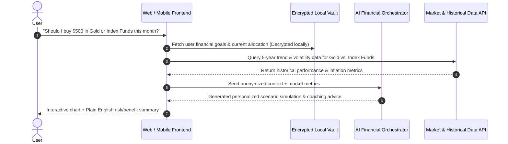

# Product Requirement Document (PRD) & Architecture
## Project: AI-Powered Wealth Mentor & Multi-Asset Intelligence

---

## 1. Executive Summary & Core Vision
The application is an **Adaptive, Privacy-First AI Wealth Mentor & Scenario Simulator**. Unlike traditional budgeting apps that passively record past expenses, or generic AI chatbots that lack financial memory, this platform actively mentors users, learns their unique money psychology and goals over time, simulates multi-asset investment scenarios (Gold, Stocks, ETFs, Commodities, Crypto), and safeguards personal financial privacy through local zero-knowledge encryption.

---

## 2. The Four Pillars (Unique Differentiators / Product Moat)

```mermaid
graph TD
    User([User]) <--> Chat[1. Conversational Financial Twin]
    Chat <--> Memory[(Encrypted Financial Profile)]
    Chat <--> SimEngine[2. What-If Scenario Simulator]
    SimEngine <--> MarketFeeds[Historical & Live Asset Feeds<br/>Gold | Stocks | Index Funds | Trends]
    Chat <--> Vault[3. Zero-Knowledge Privacy Vault]
    Chat <--> TokenLayer[4. Gamified Discipline & Token Economy]
```

### Pillar 1: "The Financial Twin" (Adaptive Financial Memory)
- **Conversational Mentor:** Engages in ongoing financial dialogues rather than static tables.
- **Behavioral Profiling:** Identifies risk appetite (Conservative, Moderate, Aggressive), spending impulses, and long-term milestones (e.g., buying a home, retirement, emergency cushion).
- **Proactive Inquiries:** Checks in periodically when users have surplus savings or when market trends create aligned investment opportunities.

### Pillar 2: "What-If" Multi-Asset Scenario Simulator
- **Asset Coverage:** Precious Metals (Gold / Silver), Equities (S&P 500, Tech, Blue Chips), Liquid Cash/Bonds, and Modern Trends.
- **Historical Backtesting in Plain English:** Allows users to ask questions like:
  - *"If I had invested $200/month into Physical Gold vs. S&P 500 over the past 5 years, how would my purchasing power look against inflation?"*
- **Opportunity Cost Calculator ("Sanity Check"):** Evaluates discretionary spending against future compounding returns.

### Pillar 3: Zero-Knowledge Privacy Architecture
- **Local Client-Side Storage:** Net worth ledgers and uploaded statements (PDF/CSV) remain encrypted on the user's device.
- **Sanitized Vector Queries:** Financial values are normalized and stripped of Personally Identifiable Information (PII) before LLM contextual synthesis.

### Pillar 4: Gamified Discipline & Token Layer
- **Streak & Literacy Rewards:** Users earn credits/tokens for maintaining savings habits, meeting monthly investment targets, and completing financial health reviews.
- **Utility Redemption:** Tokens unlock advanced institutional-grade stress testing and custom valuation models.

---

## 3. System Architecture & Data Flow



---

## 4. Feature Specifications

### 4.1. Conversational Financial Twin
- **Input Modes:** Natural text/voice chat, receipt/statement upload, manual transaction entries.
- **Context Awareness:** Tracks monthly cash flow, existing assets, debt liabilities, and milestone deadlines.

### 4.2. Multi-Asset Comparison Engine
- **Gold & Precious Metals:** Inflation hedge tracking, historical gold-to-equity ratios.
- **Equities & Index Funds:** Compound annual growth rate (CAGR), maximum drawdown, dividend yields.
- **Visual Simulations:** Interactive sliders allowing users to adjust monthly contributions, timeline (1–20 years), and risk parameters.

### 4.3. Statement Ingestion Pipeline
- **Format Support:** CSV, PDF bank/brokerage statements.
- **Categorization:** Auto-classifies transactions into Essentials, Discretionary, Savings, and Investments.

---

## 5. 0-to-1 Phased Roadmap

| Phase | Duration | Scope | Deliverables |
| :--- | :--- | :--- | :--- |
| **Phase 1** | Sprint 1–2 | **Core AI Mentor & Memory** | Chat interface, financial profile onboarding, encrypted local storage. |
| **Phase 2** | Sprint 3–4 | **Scenario Simulator** | Gold & Stock market data integration, scenario comparison graphs. |
| **Phase 3** | Sprint 5–6 | **Statement Parsing** | CSV/PDF statement parser, automated asset categorization. |
| **Phase 4** | Sprint 7+ | **Token System & Refinement** | Financial health scoring, gamified habit rewards, portfolio rebalancing alerts. |
