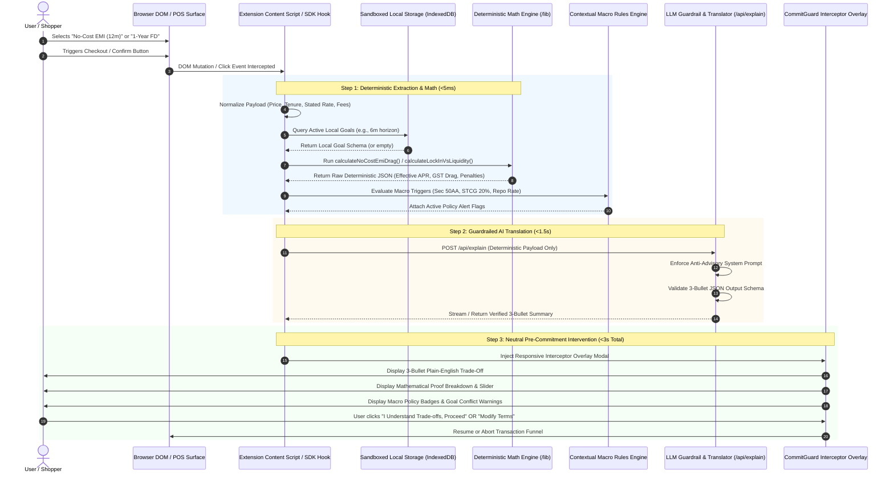
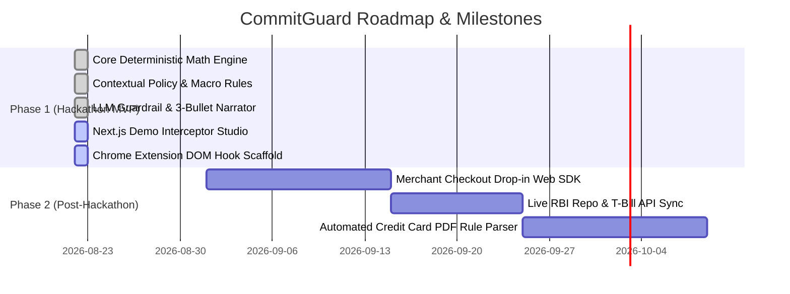

# Product Requirements Document (PRD)

## Project: CommitGuard
**Subtitle:** Embedded Pre-Commitment Interceptor for Payments & Embedded Finance  
**Hackathon Track:** Track 3 (Payments & Embedded Finance) — Problem 7: *Finance Where the Decision Happens*  
**Document Version:** 1.0.0-PROD-SPEC  
**Status:** Approved for Implementation  
**Document Owner:** Principal Technical Product Manager & Lead Systems Architect  

---

## 1. Executive Summary & Problem Framing

### 1.1 The Core Problem
Modern financial technology has optimized transaction funnels for **zero friction**. Checkout flows, instant loan widgets, credit-line opt-ins, and one-click term deposits are intentionally designed to accelerate commitment before users evaluate the hidden mathematical consequences. 

Financial blunders rarely stem from an absence of public information; they occur because **critical financial frictions—compounding effective APRs, upfront processing charges, statutory GST deductions, premature liquidation penalties, and tax bracket erosions—are computationally invisible at the precise moment of execution.**

```text
[ Current Checkout Reality ]
Cart Value: ₹80,000  ──►  "0% No-Cost EMI for 12 Months"  ──►  [ 1-Click Pay ]  ──►  Real Cost: ₹87,637 (15.2% APR)
                                  ▲
                         (Invisible Drag Zone)
```

### 1.2 Target User Personas

#### Persona A: The Impulse E-Commerce Buyer ("The Installment Optimist")
* **Profile:** Urban salaried professional (22–35 years old), frequent online shopper on platforms like Amazon, Flipkart, or Apple Store.
* **Behavior:** Chooses "No-Cost EMI" options under the impression that borrowing money is completely free.
* **Pain Point:** Fails to notice non-refundable upfront processing fees (e.g., ₹199–₹299 + 18% GST) and monthly 18% GST billed on the bank’s underlying interest component, transforming a "0% loan" into a 14%–18% Effective APR liability.
* **CommitGuard Intervention:** Intercepts checkout submission, calculates true IRR-based APR within 5ms, and displays a 3-bullet breakdown before payment OTP entry.

#### Persona B: The Young Capital Allocator ("The Yield Chaser")
* **Profile:** Early-career investor with short-to-medium-term savings targets (e.g., ₹3,00,000 earmarked for a car down payment or higher education in 6 months).
* **Behavior:** Locks funds into a 1-year Fixed Deposit (FD) for an advertised 7.10% yield, or moves capital into volatile equity mutual funds for higher headline returns.
* **Pain Point:** When withdrawing funds at Month 6, the bank imposes a 1.00% premature withdrawal penal rate plus TDS drag, yielding less than a risk-free, zero-penalty overnight/liquid fund. Alternatively, equity allocation exposes short-horizon funds to negative capital drawdowns.
* **CommitGuard Intervention:** Detects tenure-to-goal mismatch against sandboxed local storage, flags the premature exit penalty, and highlights post-tax real yields adjusted for inflation.

### 1.3 Scope & Explicit Non-Goals

| In Scope (CommitGuard Core Mandate) | Explicit Non-Goals (Strictly Prohibited) |
| :--- | :--- |
| **Point-of-Commitment Interception** (DOM overlay & POS SDK). | **No Financial Product Distribution / Affiliate Sales:** We do not earn commissions or push specific credit cards or loans. |
| **Deterministic Financial Engine:** Verifiable mathematical computation of APR, GST, tax drag, and penalties. | **No Subjective Financial Advice:** We never state *"Buy Stock X"* or *"Bank Y is the best choice."* |
| **AI Translation / Trade-Off Narration:** Translating computed numbers into structured 3-bullet plain-English trade-offs. | **No LLM-Driven Math:** The AI is strictly barred from computing financial figures or hallucinating estimates. |
| **Sandboxed Goal Volatility Detection:** Local on-device state tracking in `IndexedDB`. | **No User Profiling or Cloud Tracking:** Zero central telemetry, zero external user databases, zero PII storage. |
| **Neutral Public Directory:** Unranked, sortable reference tables of public rates and official portals. | **No Sponsored Rankings or "Top Pick" Badges:** Strictly neutral, objective tabular data. |

---

## 2. System Architecture & Sequence Flow

### 2.1 End-to-End Sequence Diagram



### 2.2 System Boundaries & Component Isolation

```text
┌──────────────────────────────────────────────────────────────────────────────────┐
│ CLIENT-SIDE RUNTIME (Browser Extension / POS Web SDK)                            │
│                                                                                  │
│  ┌───────────────────────┐   ┌────────────────────────┐   ┌───────────────────┐  │
│  │ DOM Mutation Observer │──►│ JSON Normalizer        │──►│ Sandboxed LocalDB │  │
│  │ (Scrapes checkout UI) │   │ (Sanitizes parameters) │   │ (IndexedDB goals) │  │
│  └───────────────────────┘   └────────────────────────┘   └───────────────────┘  │
│                                           │                                      │
│                                           ▼                                      │
│  ┌────────────────────────────────────────────────────────────────────────────┐  │
│  │ DETERMINISTIC CALCULATION ENGINE (/src/lib/financial-engine.ts)            │  │
│  │ • Newton-Raphson XIRR Solver  • 18% GST Compounding  • Premature Penalty   │  │
│  │ • Post-Tax Real Yield         • Opportunity Cost     • Execution: < 5ms    │  │
│  └────────────────────────────────────────────────────────────────────────────┘  │
│                                           │                                      │
│                                           ▼                                      │
│  ┌────────────────────────────────────────────────────────────────────────────┐  │
│  │ PRE-COMMITMENT INTERCEPTOR UI (/src/components/CommitGuardWidget.tsx)      │  │
│  │ • 3-Bullet Summary Card • Mathematical Proof Drawer • Macro Policy Badges  │  │
│  └────────────────────────────────────────────────────────────────────────────┘  │
└───────────────────────────────────────────┬──────────────────────────────────────┘
                                            │ HTTP POST (Computed Metrics Only)
                                            ▼
┌──────────────────────────────────────────────────────────────────────────────────┐
│ STATELESS BACKEND / EDGE SERVICE (/src/app/api/explain/route.ts)                 │
│                                                                                  │
│  ┌────────────────────────┐   ┌───────────────────────┐   ┌───────────────────┐  │
│  │ Request Sanitizer      │──►│ Guardrail Enforcer    │──►│ LLM Provider      │  │
│  │ (No PII Accepted)      │   │ (Zero-Advice Prompt)  │   │ (Gemini 2.5 / LLM)│  │
│  └────────────────────────┘   └───────────────────────┘   └───────────────────┘  │
│                                                                     │            │
│  ┌──────────────────────────────────────────────────────────────────┴─────────┐  │
│  │ Heuristic Output Validator (Blocks subjective advice, validates 3 bullets) │  │
│  └────────────────────────────────────────────────────────────────────────────┘  │
└──────────────────────────────────────────────────────────────────────────────────┘
```

---

## 3. Functional Requirements (FRs)

### FR-1: Point-of-Sale / DOM Interception Layer
* **FR-1.1 Detection Triggers:** The client script must continuously observe DOM mutations on target e-commerce and banking checkout portals, identifying:
  * Cart or checkout values exceeding threshold $P \ge ₹1,000$.
  * Payment method selection matching EMI, PayLater, Fixed Deposit booking, or Recurring Deposit initiation.
  * User interaction with final confirmation buttons (e.g., *“Place Your Order”*, *“Confirm Booking”*, *“Proceed to Pay”*).
* **FR-1.2 Non-Blocking Injection:** The interceptor overlay must mount to the DOM in $<50\text{ms}$ without degrading host page frame rates or blocking user interaction if the engine encounters an exception.
* **FR-1.3 Dismiss & Bypass Handlers:** The user must retain absolute agency. Explicit buttons (*“I Understand the Trade-off, Proceed to Checkout”* and *“Modify Selection”*) must allow instant continuation.

---

### FR-2: Deterministic Calculation Engine (`/lib/financial-engine.ts`)

All financial computations must be purely mathematical, fully deterministic, and execute in $<5\text{ms}$.

#### FR-2.1 Effective APR on "No-Cost" EMI
Retail "No-Cost EMI" schemes offer an upfront merchant discount ($D$) equal to nominal interest ($I$), but the consumer incurs an upfront processing fee ($F_p$) and statutory $18\%$ Goods and Services Tax ($\text{GST}$) on both the processing fee and every monthly interest installment ($I_k$).

1. **Upfront Outflow at $t=0$:**
   $$\text{Cash Outflow}_0 = F_p \times (1 + \text{GST}_{\text{rate}})$$
2. **Net Borrowed Principal ($P_{\text{net}}$):**
   $$P_{\text{net}} = \text{Product Price} - D$$
3. **Monthly Repayment at Period $k \in \{1, 2, \dots, n\}$:**
   $$\text{Base EMI} = \frac{P_{\text{net}} \times r_m \times (1+r_m)^n}{(1+r_m)^n - 1}$$
   $$\text{Interest Component}_k = \text{Balance}_{k-1} \times r_m$$
   $$\text{GST Component}_k = \text{Interest Component}_k \times 0.18$$
   $$\text{Total Monthly Cashflow}_k = \text{Base EMI} + \text{GST Component}_k$$
4. **Effective APR Calculation:**
   Solve for monthly internal rate of return ($r_{\text{irr}}$) via the Newton-Raphson method:
   $$\text{Product Price} - \text{Cash Outflow}_0 = \sum_{k=1}^{n} \frac{\text{Total Monthly Cashflow}_k}{(1 + r_{\text{irr}})^k}$$
   $$\text{APR}_{\text{effective}} = \left( (1 + r_{\text{irr}})^{12} - 1 \right) \times 100$$

#### FR-2.2 Lock-In vs. Liquidity & Premature Break Penalty
When capital is committed for $T$ months at rate $R_{\text{contracted}}$, but broken at month $t < T$:
1. **Penalized Rate:**
   $$R_{\text{penalized}} = \max\left(0, R_{\text{contracted}} - \text{Penalty Rate (e.g., 1.00\%)}\right)$$
2. **FD Premature Payout:**
   $$\text{Payout}_{\text{FD}} = P \times \left(1 + \frac{R_{\text{penalized}}}{400}\right)^{4 \times (t / 12)}$$
3. **Liquid / Overnight Fund Alternative:**
   $$\text{Payout}_{\text{Liquid}} = P \times \left(1 + \frac{R_{\text{liquid}}}{36500}\right)^{365 \times (t / 12)}$$
4. **Liquidity Trap Condition:**
   $$\text{IsLiquidityTrap} = \begin{cases} \text{TRUE} & \text{if } \text{Payout}_{\text{Liquid}} > \text{Payout}_{\text{FD}} \\ \text{FALSE} & \text{otherwise} \end{cases}$$

#### FR-2.3 Post-Tax Real Yield
$$\text{Nominal Post-Tax Rate} = R_{\text{nominal}} \times (1 - T_{\text{slab}})$$
$$\text{Real Yield} = \left( \frac{1 + \text{Nominal Post-Tax Rate}}{1 + I_{\text{inflation}}} \right) - 1$$

#### FR-2.4 Sovereign Opportunity Cost Benchmarking
$$\text{Opportunity Spread} = R_{\text{commitment}} - R_{\text{sovereign\_91d\_tbill}}$$
$$\text{Dollar Opportunity Cost} = P \times \left(\frac{\text{Opportunity Spread}}{100}\right) \times \left(\frac{t}{12}\right)$$

---

### FR-3: Contextual Policy & Macro Rules Engine (`/lib/policy-alerts.ts`)

The policy engine evaluates active regulatory statutes against the commitment type:

```typescript
export interface PolicyRule {
  ruleId: string;
  triggerContext: 'DEBT_MF' | 'EQUITY_STCG' | 'BANK_FD_TDS' | 'REPO_RATE_SPREAD';
  regulatoryClause: string;
  condition: (input: any) => boolean;
  alertTitle: string;
  alertSummary: string;
  severity: 'WARNING' | 'CRITICAL' | 'INFO';
}
```

* **Rule PR-1 (Section 50AA - Debt Mutual Fund Slab Taxation):** Triggers if user evaluates debt funds; warns that indexation benefits are eliminated for funds with $<35\%$ equity exposure, taxing gains at marginal income slabs (up to $39\%$).
* **Rule PR-2 (Section 111A - Equity STCG Update):** Triggers on equity investments held $<12$ months; enforces the updated $20\%$ Short-Term Capital Gains tax rate (and $12.5\%$ LTCG under Section 112).
* **Rule PR-3 (Section 194A - Bank TDS Deduction):** Triggers on Fixed Deposits exceeding ₹40,000 interest per fiscal year (₹50,000 for senior citizens), warning of $10\%$ TDS deduction at source.
* **Rule PR-4 (RBI Repo Rate Spread):** Compares bank lending/deposit spreads against the benchmark RBI repo rate ($6.50\%$).

---

### FR-4: AI Narrative Translator & Prompt Guardrails (`/lib/llm-guardrail.ts`)

#### FR-4.1 Strict Role Definition
The AI model acts strictly as a **neutral trade-off narrator and translator**. It is strictly prohibited from:
1. Formulating subjective recommendations (*"You should avoid this"*, *"This is bad"*, *"We recommend alternative X"*).
2. Calculating or altering numeric data.
3. Picking or ranking individual commercial banks or mutual fund schemes.

#### FR-4.2 Input Payload Schema (Sent to `/api/explain`)
```json
{
  "commitmentType": "NO_COST_EMI",
  "productPrice": 80000,
  "tenureMonths": 12,
  "advertisedRate": 0,
  "computedMetrics": {
    "effectiveApr": 15.24,
    "totalGstDrag": 1438.20,
    "processingFee": 199.00,
    "totalTrueCost": 87637.20,
    "benchmarkSpread": 8.74
  },
  "activePolicyAlerts": ["GST_RULE_18", "PROCESSING_FEE_DRAG"],
  "goalConflict": null
}
```

#### FR-4.3 Output JSON Schema & Tone Enforcement
The API must return an enforced JSON object containing exactly 3 bullet points:
```json
{
  "bullet_1_hidden_friction": "While advertised at 0% interest, upfront processing fees (₹199) and 18% monthly GST on interest charges (₹1,438 total) result in a true Effective APR of 15.2%.",
  "bullet_2_liquidity_horizon": "Committing to this 12-month installment locks ₹7,303 in monthly cash outflows, reducing short-term disposable liquidity for the next year.",
  "bullet_3_neutral_baseline": "Mathematically, paying upfront or selecting a shorter tenure eliminates ₹1,637 in combined fee and tax friction relative to 91-day sovereign benchmarks.",
  "status": "GUARDRAIL_VERIFIED"
}
```

#### FR-4.4 Heuristic Anti-Advisory Validator
The backend response passes through a regex filter before serialization. Any occurrence of prohibited tokens (`recommend`, `you should`, `best bank`, `top pick`, `bad deal`, `buy now`) triggers automatic rejection and falls back to a deterministic template string.

---

### FR-5: Local Session Memory & Inconsistency Detection (`/lib/storage.ts`)

* **FR-5.1 Sandboxed Storage:** All user goal states are stored locally on-device using `IndexedDB` under the key `commitguard_local_goals`.
* **FR-5.2 Schema:**
  ```typescript
  export interface SandboxedGoal {
    goalId: string;
    title: string;                 // e.g., "Vehicle Down Payment"
    targetAmount: number;          // e.g., 300000
    targetHorizonMonths: number;   // e.g., 6
    earmarkedAmount: number;       // e.g., 250000
    riskTolerance: 'ZERO_LOSS' | 'MODERATE' | 'FLEXIBLE';
    createdAtTimestamp: number;
  }
  ```
* **FR-5.3 Conflict-Detection Heuristic:**
  If a user commits funds ($P \ge ₹25,000$) to an instrument with $\text{Tenure} > \text{Goal.targetHorizonMonths}$ OR $\text{Volatility} = \text{HIGH}$ while $\text{Goal.riskTolerance} = \text{'ZERO_LOSS'}$, CommitGuard triggers a **High-Priority Goal Inconsistency Banner**.

---

### FR-6: Neutral Reference Directory (`/lib/neutral-directory.ts`)

* **FR-6.1 Tabular Reference:** A clean, sortable reference table displaying public interest rates, tenure brackets, premature exit penalties, and links to official customer portals.
* **FR-6.2 Strict Ranking Neutrality:** No default "recommended" sort. Default ordering is strictly alphabetical by institution name. Users may sort only by objective columns (e.g., *“Lowest Premature Penalty”*, *“1-Year Rate”*).
* **FR-6.3 Direct Deep Links:** Direct links to public regulatory rate cards and official net banking portals; zero affiliate or redirect tracking parameters.

---

## 4. Non-Functional Requirements (NFRs)

### 4.1 Performance & Latency Budgets
* **Math Execution Time:** Deterministic calculations must execute in $\le 5\text{ms}$ on standard mobile/desktop hardware.
* **DOM Injection Latency:** Interceptor overlay must render within $\le 50\text{ms}$ of event trigger.
* **LLM Streaming Latency:** AI plain-English translation must stream or return within $\le 1.5\text{s}$ (with a $\le 2.0\text{s}$ hard timeout fallback to deterministic template text).
* **Total Time-to-Clarity:** $\le 3.0\text{s}$ total elapsed time from user trigger to complete visual comprehension.

### 4.2 Privacy, Data Isolation & Security
* **Zero Telemetry Mandate:** No central databases, analytics trackers (Mixpanel, GA4), or logging servers.
* **Stateless API:** `/api/explain` receives only numeric parameters; zero user IDs, IP addresses, names, or session tokens are stored.
* **Client-Side Sandboxing:** All goal records remain in browser-isolated `IndexedDB`.

### 4.3 Reliability & Resilience
* **Offline Capability:** If network connectivity drops or the LLM API fails, the application falls back seamlessly to deterministic calculation cards and pre-compiled rule templates with zero UI breakage.

### 4.4 Legal & Compliance Boundary
* **Educational Disclaimer:** The UI prominently renders:  
  *“CommitGuard provides deterministic mathematical trade-off simulations and objective policy translations for educational clarity. CommitGuard is not a SEBI-registered investment advisor and does not provide financial recommendations.”*

---

## 5. Hackathon Scope (MVP) vs. Future Roadmap



### Phase 1: Hackathon MVP Scope (Deliverable)
1. **Interactive Demo Studio (`/src/app/page.tsx`):**
   * Simulated E-Commerce Checkout (₹80,000 Laptop with 12m No-Cost EMI).
   * Simulated Banking Portal (₹5,00,000 1-Year FD with 6-month goal conflict).
   * Simulated Debt Mutual Fund Tax Drag scenario.
2. **Deterministic Calculation Core (`/src/lib/financial-engine.ts`):** Complete test-covered math algorithms for Effective APR, Premature Break, and Real Yield.
3. **Guardrailed AI Endpoint (`/src/app/api/explain/route.ts`):** Structured 3-bullet narrator powered by Gemini / LLM with anti-advisory verification.
4. **Sandboxed On-Device Goal Tracker (`/src/lib/storage.ts`):** IndexedDB goal management.
5. **Neutral Directory (`/src/components/NeutralDirectory.tsx`):** Unranked, sortable public rate card table.
6. **Chrome Extension Scaffold (`/src/extension`):** Manifest V3 content script for real-world checkout DOM parsing.

### Phase 2: Post-Hackathon Production Roadmap
1. **Embedded Merchant POS Web SDK:** Drop-in `<script>` tag for Shopify, WooCommerce, and payment gateways (Razorpay, Stripe) allowing merchants to offer ethical checkout transparency.
2. **Automated Regulatory & Repo Sync:** Automated daily scraping of RBI notifications, clearing corporation yields, and Sovereign Gold Bond (SGB) calendars.
3. **Credit Card Statement & Policy Parser:** Client-side WebAssembly parser for credit card reward structures, lounge access policy changes, and hidden fee revisions.

---

## 6. Success Metrics & Verification Criteria

| Key Performance Indicator (KPI) | Target Metric | Verification Method |
| :--- | :--- | :--- |
| **Mathematical Precision** | $100\%$ accuracy against banking amortization schedules | Automated unit tests comparing IRR outputs to Excel XIRR formulas |
| **Decision Latency** | $< 3.0$ seconds total time-to-clarity | Client-side performance timing markers (`performance.now()`) |
| **Guardrail Integrity** | $0$ advisory violations in 1,000 sample runs | Automated heuristic test suite scanning for forbidden advisory tokens |
| **Data Privacy** | $0\text{ bytes}$ transmitted to third-party trackers | Network tab inspection confirming zero external telemetry requests |

---

## 7. Sign-off & Approvals

| Role | Status | Date |
| :--- | :--- | :--- |
| **Lead Systems Architect** | ✅ APPROVED | 2026-08-22 |
| **Principal Technical Product Manager** | ✅ APPROVED | 2026-08-22 |
| **Hackathon Engineering Lead** | ✅ READY FOR SCAFFOLDING | 2026-08-22 |
