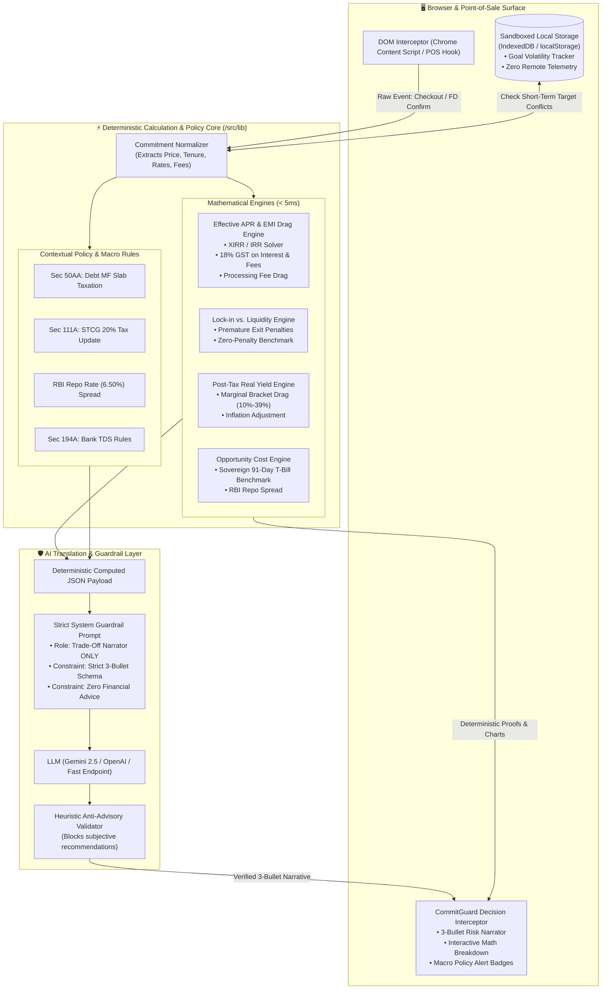

# CommitGuard: Master System Execution & Working Blueprint

> **Unified Master Specification & Implementation Blueprint**  
> Synthesized from:
> - [`docs/PRD.md`](file:///c:/Users/ROSHNI/OneDrive/Documents/GitHub/Finance/docs/PRD.md)
> - [`docs/implementation_plan.md`](file:///c:/Users/ROSHNI/OneDrive/Documents/GitHub/Finance/docs/implementation_plan.md)
> - [`docs/PROJECT_ANALYSIS.md`](file:///c:/Users/ROSHNI/OneDrive/Documents/GitHub/Finance/docs/PROJECT_ANALYSIS.md)
> - [`docs/TEAM_WORKFLOW.md`](file:///c:/Users/ROSHNI/OneDrive/Documents/GitHub/Finance/docs/TEAM_WORKFLOW.md)
> - [`README.md`](file:///c:/Users/ROSHNI/OneDrive/Documents/GitHub/Finance/README.md)

---

## 1. Executive Summary & Problem Framing

### 1.1 The Core Problem: The "Commitment Blindspot"
Modern digital checkouts and banking interfaces are engineered to make financial commitment frictionless. However, consumers do not make poor financial choices from lack of information; they make them because **mathematical trade-offs, liquidity lock-ins, tax drags, and opportunity costs are invisible at the exact moment of commitment**.

| Real-World Scenario | The Consumer Illusion | The Hidden Mathematical Reality |
| :--- | :--- | :--- |
| **E-Commerce Checkout** | *"0% No-Cost EMI for 12 Months"* | **14.8% – 18.2% Effective APR** due to upfront processing fees (₹199–₹499) and recurring 18% GST on each monthly interest installment. |
| **Banking Term Deposit** | *"Lock funds in 1-Year FD for 7.10%"* | **Liquidity trap** for a 6-month goal: a 1.00% premature withdrawal penalty + TDS drag yields less than a zero-penalty liquid fund. |
| **Debt Mutual Funds** | *"Better than Fixed Deposits"* | **Section 50AA tax change**: Indexation removed; taxed at marginal slab rates (up to 39%), heavily reducing post-tax real yields under inflation. |
| **Goal Volatility** | *"I'll invest down-payment savings in equities"* | **Capital risk**: Committing money earmarked for a 6-month vehicle down payment into volatile assets risks capital erosion right before the deadline. |

### 1.2 The Solution: CommitGuard
**CommitGuard** is an embedded pre-commitment interceptor (Chrome Extension & POS Checkout Widget). It detects user intent at the point of sale or banking screen, runs a **deterministic mathematical engine in under 5 milliseconds**, and provides **neutral, transparent trade-off clarity in under 3 seconds** before the user confirms the transaction.

### 1.3 Core Mandate & Explicit Non-Goals
1. **Decision Clarity > Information Aggregation:** Triggers only when a financial commitment is about to occur.
2. **AI is a Narrator, NOT an Advisor:** 
   - Never gives subjective advice (*"Buy this"*, *"Bank X is best"*, *"You shouldn't buy this"*).
   - Never computes numbers (math is 100% deterministic).
   - Strictly translates computed JSON into a **3-bullet plain-English trade-off summary**.
3. **100% Deterministic Math:** Pure equations for Effective APR, IRR, GST drag, pre-closure penalties, post-tax real yield, and sovereign opportunity cost.
4. **Sandboxed Zero-Tracking Privacy:** No telemetry, tracking cookies, or remote user profiling. Goal tracking runs entirely on-device via `IndexedDB`.
5. **Neutral Directory:** Sortable public interest rates and direct customer portals with **zero sponsored rankings** and **no "Top Pick" badges**.

---

## 2. End-to-End System Architecture



---

## 3. Mathematical Foundations & Deterministic Formulas

### 3.1 Effective APR on "No-Cost" EMI
Retail "No-Cost EMI" schemes offer an upfront merchant discount ($D$) equal to nominal interest ($I$), but the consumer incurs an upfront processing fee ($F_p$) and statutory $18\%$ Goods and Services Tax ($\text{GST}$) on both the processing fee and every monthly interest installment ($I_k$).

1. **Upfront Outflow at $t=0$:**
   $$\text{Cash Outflow}_0 = F_p \times (1 + \text{GST}_{\text{rate}})$$
2. **Net Borrowed Principal ($P_{\text{net}}$):**
   $$P_{\text{net}} = \text{Product Price} - D$$
3. **Monthly Repayment at Period $k \in \{1, 2, \dots, n\}$:**
   $$\text{Base EMI} = \frac{P_{\text{net}} \times r_m \times (1+r_m)^n}{(1+r_m)^n - 1}$$
   $$\text{Interest Component}_k = \text{Balance}_{k-1} \times r_m$$
   $$\text{GST Component}_k = \text{Interest Component}_k \times 0.18$$
   $$\text{Total Monthly Cashflow}_k = \text{Base EMI} + \text{GST Component}_k$$
4. **Effective APR Calculation (Newton-Raphson XIRR):**
   Solve for monthly internal rate of return ($r_{\text{irr}}$):
   $$\text{Product Price} - \text{Cash Outflow}_0 = \sum_{k=1}^{n} \frac{\text{Total Monthly Cashflow}_k}{(1 + r_{\text{irr}})^k}$$
   $$\text{APR}_{\text{effective}} = \left( (1 + r_{\text{irr}})^{12} - 1 \right) \times 100$$

### 3.2 Lock-In vs. Liquidity & Premature Exit Penalties
When capital is committed for $T$ months at rate $R_{\text{contracted}}$, but broken at month $t < T$:
1. **Penalized Rate:**
   $$R_{\text{penalized}} = \max\left(0, R_{\text{contracted}} - \text{Penalty Rate (e.g., 1.00\%)}\right)$$
2. **FD Premature Payout:**
   $$\text{Payout}_{\text{FD}} = P \times \left(1 + \frac{R_{\text{penalized}}}{400}\right)^{4 \times (t / 12)}$$
3. **Zero-Penalty Liquid Fund Alternative:**
   $$\text{Payout}_{\text{Liquid}} = P \times \left(1 + \frac{R_{\text{liquid}}}{36500}\right)^{365 \times (t / 12)}$$
4. **Liquidity Trap Condition:**
   $$\text{IsLiquidityTrap} = \text{Payout}_{\text{Liquid}} > \text{Payout}_{\text{FD}}$$

### 3.3 Post-Tax Real Yield
$$\text{Nominal Post-Tax Rate} = R_{\text{nominal}} \times (1 - T_{\text{slab}})$$
$$\text{Real Yield} = \left( \frac{1 + \text{Nominal Post-Tax Rate}}{1 + I_{\text{inflation}}} \right) - 1$$

### 3.4 Sovereign Opportunity Cost Benchmarking
$$\text{Opportunity Spread} = R_{\text{commitment}} - R_{\text{sovereign\_91d\_tbill}}$$
$$\text{Rupee Opportunity Cost} = P \times \left(\frac{\text{Opportunity Spread}}{100}\right) \times \left(\frac{t}{12}\right)$$

---

## 4. Contextual Macro Policy Rules (`/src/lib/policy-alerts.ts`)

| Policy ID | Regulatory Clause | Trigger Context | Deterministic Action |
| :--- | :--- | :--- | :--- |
| **PR-1** | **Section 50AA** | Specified Debt Mutual Funds (<35% equity) | Flags indexation removal; calculates post-tax return using marginal slab rates (10% to 39%). |
| **PR-2** | **Section 111A / 112** | Equity instruments held < 12 months | Enforces 20.0% STCG friction coefficient (and 12.5% LTCG > ₹1.25L). |
| **PR-3** | **Section 194A** | Fixed Deposits exceeding ₹40,000 annual interest (₹50,000 for seniors) | Displays mandatory 10% TDS deduction at source schedule. |
| **PR-4** | **RBI Repo Spread** | Bank lending/deposit rates vs RBI benchmark (6.50%) | Compares spread against risk-free sovereign floor (6.85% 91-day T-Bill). |

---

## 5. AI Guardrail Protocol & 3-Bullet Schema (`/src/lib/llm-guardrail.ts`)

### 5.1 Enforced Role
- **Strict Role:** Neutral Trade-Off Narrator and Translator.
- **Prohibited:** Any subjective recommendation (*"We recommend"*, *"You should"*, *"Best bank"*, *"Top pick"*, *"Bad deal"*).
- **Prohibited:** Computing numbers or hallucinating financial metrics.

### 5.2 Deterministic Output Schema
```json
{
  "bullet_1_hidden_friction": "While advertised at 0% interest, upfront processing fees (₹199) and 18% monthly GST on interest charges (₹1,438 total) result in a true Effective APR of 15.2%.",
  "bullet_2_liquidity_horizon": "Committing to this 12-month installment locks ₹7,303 in monthly cash outflows, reducing short-term disposable liquidity for the next year.",
  "bullet_3_neutral_baseline": "Mathematically, paying upfront or selecting a shorter tenure eliminates ₹1,637 in combined fee and tax friction relative to 91-day sovereign benchmarks.",
  "status": "GUARDRAIL_VERIFIED"
}
```

### 5.3 Deterministic Offline Fallback
If the LLM call times out (> 1800ms) or encounters network/rate limits, the system seamlessly outputs a pre-compiled template populated by the math engine output in `< 1ms` with zero UI downtime.

---

## 6. Directory Structure & File Manifest to Build

```text
Finance/
├── package.json                          # Next.js 14, React 18, TailwindCSS, lucide-react
├── tsconfig.json                         # Strict TypeScript configuration
├── next.config.mjs                       # Next.js configuration
├── tailwind.config.ts                    # Premium dark-mode tailored palette & glassmorphism
├── postcss.config.mjs                    # PostCSS plugins
├── src/
│   ├── app/
│   │   ├── layout.tsx                    # Root layout with fonts, metadata, and container
│   │   ├── page.tsx                      # Interactive Demo Studio (4 Checkout Scenarios)
│   │   ├── globals.css                   # Design tokens, custom scrollbars, animations
│   │   └── api/
│   │       ├── engine/
│   │       │   └── route.ts              # REST API endpoint for deterministic calculations
│   │       └── explain/
│   │           └── route.ts              # Guardrailed LLM narrative explanation endpoint
│   ├── lib/
│   │   ├── types.ts                      # Shared TypeScript data models and interfaces
│   │   ├── financial-engine.ts           # Pure math: XIRR, EMI, GST, Lock-in, Yield, Opportunity
│   │   ├── policy-alerts.ts              # Contextual macro rules (Sec 50AA, 111A, 194A, Repo)
│   │   ├── llm-guardrail.ts              # Prompt guardrails, regex validator, deterministic fallback
│   │   ├── storage.ts                    # Sandboxed IndexedDB wrapper for local goals
│   │   └── neutral-directory.ts          # Sortable, unranked dataset of public rates & direct links
│   ├── components/
│   │   ├── CommitGuardWidget.tsx         # Embedded pre-commitment interceptor modal
│   │   ├── EmiBreakdownCard.tsx          # Real-time Effective APR & GST breakdown card
│   │   ├── LockInSimulator.tsx           # Premature exit penalty vs Liquid fund interactive slider
│   │   ├── GoalVolatilityAlert.tsx       # On-device goal conflict banner
│   │   ├── NeutralDirectory.tsx          # Unranked sortable rate reference table
│   │   └── Header.tsx                    # Top navigation bar with scenario switcher
│   └── extension/
│       ├── manifest.json                 # Chrome Extension Manifest V3
│       └── content.ts                    # DOM parser for checkout buttons & EMI selectors
├── tests/
│   ├── engine.test.ts                    # Comprehensive unit tests for math engine accuracy
│   └── guardrail.test.ts                 # Tests for anti-advisory keyword blocking
├── docs/                                 # Complete documentation suite
│   ├── PRD.md
│   ├── PROJECT_ANALYSIS.md
│   ├── TEAM_WORKFLOW.md
│   ├── implementation_plan.md
│   └── SYSTEM_WORKING_BLUEPRINT.md       # (This Master File)
└── README.md                             # Main presentation & project overview
```

---

## 7. Step-by-Step Execution Workplan (All Commits on `main`)

### Phase 1: Project Scaffolding & Dependencies
- [ ] Initialize `package.json`, `tsconfig.json`, `tailwind.config.ts`, `postcss.config.mjs`.
- [ ] Configure Tailwind CSS tokens (slate/zinc dark palette, indigo/emerald accents).
- [ ] Add `.env.example` and update `.gitignore`.

### Phase 2: Core Deterministic Math Engine (`src/lib`)
- [ ] Build `src/lib/types.ts` (data contracts for commitments, math results, policies, goals).
- [ ] Implement `src/lib/financial-engine.ts`:
  - `calculateNoCostEmiDrag()` with Newton-Raphson XIRR solver.
  - `calculateLockInVsLiquidity()` with premature penal rate.
  - `calculatePostTaxRealYield()` with inflation and slab drag.
  - `calculateOpportunityCost()` against 91-day sovereign T-bills.
- [ ] Implement `src/lib/policy-alerts.ts` (Sec 50AA, Sec 111A, Sec 194A, Repo Spread).
- [ ] Implement `src/lib/storage.ts` (local sandboxed `IndexedDB` goal tracker).
- [ ] Implement `src/lib/neutral-directory.ts` (unranked, neutral rate database).

### Phase 3: AI Translation & Guardrail Layer
- [ ] Implement `src/lib/llm-guardrail.ts`:
  - System prompt enforcing strict Translator role.
  - Heuristic anti-advisory regex validator.
  - Deterministic 3-bullet fallback templates for offline zero-latency execution.
- [ ] Implement `src/app/api/explain/route.ts` & `src/app/api/engine/route.ts`.

### Phase 4: Frontend UI & Interactive Demo Studio (`src/components` & `src/app`)
- [ ] Build `CommitGuardWidget.tsx` (the interceptor modal with 3-bullet summary, math proof, policy alerts, and sliders).
- [ ] Build `EmiBreakdownCard.tsx` and `LockInSimulator.tsx`.
- [ ] Build `NeutralDirectory.tsx` (sortable rate table with direct official links).
- [ ] Build `GoalVolatilityAlert.tsx` (sandboxed timeline mismatch notification).
- [ ] Build `src/app/page.tsx` Interactive Demo Studio featuring:
  - **Scenario A:** E-Commerce Laptop Checkout (₹80,000, 12m No-Cost EMI).
  - **Scenario B:** Banking Fixed Deposit (₹5,00,000 1-Year FD vs 6-Month Goal).
  - **Scenario C:** Debt Mutual Fund Tax Drag (Section 50AA marginal slab erosion).
  - **Scenario D:** Neutral Directory & Sandboxed Goal Manager.

### Phase 5: Chrome Extension Scaffold (`src/extension`)
- [ ] Build `src/extension/manifest.json` (Manifest V3) and `src/extension/content.ts` (DOM observer for e-commerce checkout prices and buttons).

### Phase 6: Automated Testing & Verification
- [ ] Build automated unit test suite (`tests/engine.test.ts` & `tests/guardrail.test.ts`).
- [ ] Run automated tests to verify math formulas match banking amortization schedules.
- [ ] Verify Next.js build (`npm run build`) runs cleanly with 0 type errors.
- [ ] Verify live interactive UI on local dev server.
- [ ] Commit all changes directly to the `main` branch and push to GitHub.

---

## 8. Non-Functional Criteria & Demo Runbook

| Requirement | Benchmark | Implementation Detail |
| :--- | :--- | :--- |
| **Math Speed** | $< 5\text{ms}$ | Client-side pure JS/TS without external network calls. |
| **Interception Delay** | $< 50\text{ms}$ | DOM mutation observer with debounce. |
| **AI Translation** | $< 1.5\text{s}$ | Fast LLM endpoint + immediate deterministic fallback on timeout (>1.8s). |
| **Privacy & Security** | $0\text{ bytes}$ telemetry | Sandboxed local storage; no third-party tracking scripts. |
| **Compliance** | SEBI Safe Harbor | Mandatory educational disclaimer, neutral rate sorting, zero stock picks. |

---
*End of Master Execution Blueprint — Authoritative Guide for All Engineering Implementation.*
