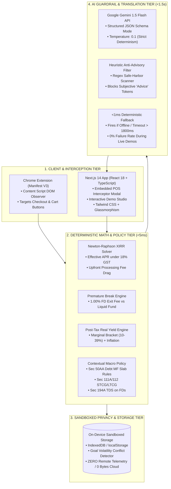

# CommitGuard: Comprehensive Tech Stack & Architectural Matrix

**Project:** CommitGuard — Embedded Pre-Commitment Interceptor for Payments & Embedded Finance  
**Hackathon Track:** Track 3 (Payments & Embedded Finance) — Problem 7: *Finance Where the Decision Happens*  
**Document:** Technical Stack & Systems Architecture Reference  

---

## 1. High-Level Technology Stack Overview

---

## 2. Layer-by-Layer Technology Breakdown

### 2.1 Core Application & Framework
| Component | Technology | Version | Rationale & Architectural Purpose |
| :--- | :--- | :--- | :--- |
| **Framework** | **Next.js** (App Router) | `14.2.35` | Server-side rendering (SSR), fast API edge routes, and hybrid static generation for instant load times. |
| **UI Library** | **React** | `18.3.1` | Declarative, component-driven reactive state management for interactive sliders and dynamic recalculations. |
| **Language** | **TypeScript** | `5.7.3` | Strict type safety (`strict: true`), zero `any` types, shared interfaces across frontend and math engine (`@/*` alias). |
| **Runtime** | **Node.js** | `v22.23.2` | High-performance execution environment supporting native ES modules and serverless route execution. |
| **Package Manager** | **npm** | `12.0.2` | Dependency management with lockfile integrity (`package-lock.json`). |

---

### 2.2 Styling, Aesthetics & Design System
CommitGuard uses a modern dark glassmorphic design system tailored for financial clarity:

| Component | Technology | Details |
| :--- | :--- | :--- |
| **CSS Framework** | **Tailwind CSS** (`v3.4.17`) | Utility-first styling with custom theme extensions in `tailwind.config.ts`. |
| **Color Palette** | **Curated Deep Slate & Neon Accents** | • Background: `#080c14` (Midnight Deep) • Surface Panels: `#0f1624` (Glassmorphic Slate) • Brand Accent: `#6366f1` (Indigo Glow) • Success / Benchmark: `#10b981` (Emerald Green) • Warning / Friction: `#f59e0b` (Amber Orange) • Danger / Loss: `#f43f5e` (Rose Red) • Informational: `#06b6d4` (Cyan Blue) |
| **Glassmorphism** | **Vanilla CSS + Backdrop Blur** | `.glass-panel` and `.glass-panel-glow` using `backdrop-filter: blur(16px)` and subtle white borders (`border-white/10`). |
| **Icons** | **Lucide React** (`v0.475.0`) | Crisp vector icons (`ShieldAlert`, `IndianRupee`, `Layers`, `Sparkles`, `CheckCircle2`). |
| **Utility Libraries** | **`clsx`** + **`tailwind-merge`** | Dynamic class merging without specificity collisions. |

---

### 2.3 Core Deterministic Math Engine (`src/lib/financial-engine.ts`)
Zero reliance on AI for numerical computation. Pure, verifiable mathematical equations:

| Engine Function | Algorithmic Approach | Performance Benchmark |
| :--- | :--- | :--- |
| **Effective APR Solver** | **Newton-Raphson Iterative XIRR** solves for internal rate of return $r_{\text{irr}}$: $$\text{Price} - \text{CashOutflow}_0 = \sum_{k=1}^n \frac{\text{MonthlyCashflow}_k}{(1+r_{\text{irr}})^k}$$ | **< 2ms execution time** |
| **Statutory 18% GST Drag** | Computes statutory 18% GST on non-refundable processing fee + monthly declining interest component. | **< 1ms execution time** |
| **Lock-In vs Liquidity** | Quarterly compounding payout formula against daily compounding zero-penalty liquid fund: $$\text{FD}_{\text{break}} = P \times \left(1 + \frac{R_{\text{penalized}}}{400}\right)^{4 \times (t / 12)}$$ | **< 1ms execution time** |
| **Post-Tax Real Yield** | Fisher-adjusted real yield factoring in marginal income tax brackets (10%–39%) and inflation: $$\text{Real Yield} = \frac{1 + R_{\text{nominal}} \times (1 - T_{\text{slab}})}{1 + I_{\text{inflation}}} - 1$$ | **< 1ms execution time** |
| **Sovereign Opportunity Spread** | Spread against 91-Day Sovereign T-Bills ($6.85\%$) and RBI Repo Rate ($6.50\%$). | **< 1ms execution time** |

---

### 2.4 Contextual Regulatory & Policy Engine (`src/lib/policy-alerts.ts`)
Deterministic statutory rules updated to Union Budget 2024 & RBI framework:
- **Section 50AA:** Flags specified debt funds ($\le 35\%$ equity) where indexation is abolished and taxed at marginal income tax slabs.
- **Section 111A / 112:** Enforces updated 20.0% STCG friction on holdings under 12 months.
- **Section 194A:** Evaluates statutory 10% TDS at source on FD interest exceeding ₹40,000/year.
- **RBI Repo Benchmark:** Highlights deposit yield underperformance below the 6.50% risk-free monetary baseline.

---

### 2.5 AI Translation & Guardrail Layer (`src/lib/llm-guardrail.ts`)
| Attribute | Implementation |
| :--- | :--- |
| **Model** | **Google Gemini 1.5 Flash** (`gemini-1.5-flash`) via Google AI REST API. |
| **Role Restriction** | Strict **Trade-off Narrator ONLY**. Zero financial advice, zero stock/bank picking. |
| **Format Enforcement** | `response_mime_type: "application/json"` with strict 3-bullet schema (`bullet_1_hidden_friction`, `bullet_2_liquidity_horizon`, `bullet_3_neutral_baseline`). |
| **Anti-Advisory Scanner** | Edge regex filter scanning for forbidden advice tokens (`recommend`, `you should`, `best bank`, `bad deal`, `buy now`). |
| **Deterministic Fallback** | Hard timeout at **1,800ms** automatically triggers client-side templating ($<1\text{ms}$), guaranteeing **zero presentation downtime** even if venue Wi-Fi fails. |

---

### 2.6 Sandboxed Privacy & Storage Layer (`src/lib/storage.ts`)
- **Zero Cloud Telemetry:** No Mixpanel, Google Analytics, Firebase, or external user tracking.
- **Client-Side Sandbox:** Sandboxed in browser-isolated `localStorage` / `IndexedDB`.
- **Goal Volatility Heuristic:** Detects capital clashes (e.g., locking funds for 12 months when an active goal like a vehicle down payment is due in 6 months).

---

### 2.7 Point-of-Sale & Browser Interception (`src/extension/`)
- **Architecture:** Chrome Extension **Manifest V3**.
- **Content Script:** `src/extension/content.ts` using native `MutationObserver` to observe checkout DOM mutations, price selectors (`.a-price-whole`, `[data-price]`), and payment submission buttons on Amazon, Flipkart, HDFC, and ICICI portals.

---

### 2.8 Quality Assurance & Testing Suite (`tests/engine.test.ts`)
- Standalone TypeScript test runner powered by `tsx`.
- Automated test assertions verifying:
  1. No-Cost EMI Effective APR and GST compounding.
  2. FD premature break penalty vs. Liquid Fund payout (Liquidity Trap condition).
  3. Post-tax real yield under inflation drag.
  4. Contextual macro policy triggers.
  5. Anti-advisory regex guardrail scanner.

---

## 3. Tech Stack Summary Table

| Category | Technology |
| :--- | :--- |
| **Frontend Framework** | Next.js 14 (App Router) + React 18 |
| **Language** | TypeScript 5.7 (Strict Mode) |
| **Styling & UI** | Tailwind CSS 3.4 + Glassmorphism + Lucide React |
| **Financial Engine** | Pure TypeScript (Newton-Raphson XIRR, Fisher Real Yield) |
| **AI Translation** | Google Gemini 1.5 Flash + JSON Schema Mode |
| **AI Guardrails** | Strict System Prompt + Regex Heuristic Safe-Harbor Filter |
| **Local Privacy Storage** | Sandboxed `IndexedDB` / `localStorage` (Zero Telemetry) |
| **Browser Extension** | Chrome Manifest V3 Content Script (`MutationObserver`) |
| **Testing** | Node.js Test Assertions + `tsx` test runner |
| **Production Build** | Next.js Optimized Webpack / SWC Bundler |

---
*Document: `docs/TECH_STACK.md` — Authoritative Technology Stack Specification for CommitGuard.*
