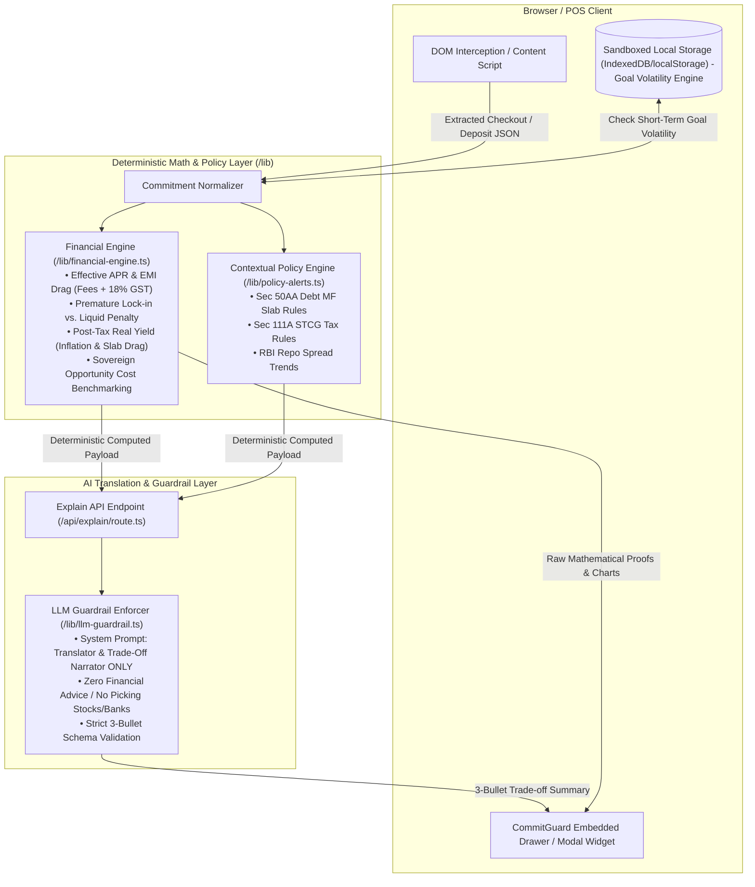

# Implementation Plan: CommitGuard Architecture & Core Scaffolding

**Track:** Hackathon Track 3 (Payments & Embedded Finance) — Problem 7: *Finance Where the Decision Happens*  
**Core Philosophy:** *Decision Clarity > Information Aggregation*  
**Role:** Embedded Pre-Commitment Interceptor (Chrome Extension & POS Checkout Widget)

---

## Architecture Overview

---

## User Review Required

> [!IMPORTANT]
> **Key Architecture Decisions:**
> 1. **Zero Financial Advisory Mandate:** The LLM is never invoked to compute numbers or suggest investment choices. It operates purely as a deterministic payload narrator with strict regex/heuristic anti-advisory guardrails.
> 2. **Sub-3-Second Performance Target:** All core calculations occur locally on-device in `< 5ms`. The optional AI plain-English translation streams in `< 1.2s`.
> 3. **Sandboxed Zero-Tracking Privacy:** No telemetry, tracking cookies, or remote databases for user profiles. Only on-device storage for high-frequency goal volatility detection.

---

## Proposed Changes & Code Structure

### 1. Root & Documentation
#### [NEW] `README.md`
- Complete Hackathon project overview, Problem Statement (Finance Where the Decision Happens).
- System architecture diagram (Mermaid + ASCII fallback).
- Mathematical formulae & proofs (Effective APR calculation with upfront processing fees and 18% GST, premature penalty drag, post-tax real yield).
- 90-second Demo Runbook (e-commerce EMI checkout interception).
- Quickstart & verification steps.

#### [NEW] `package.json` & `tsconfig.json`
- Next.js 14+ / React / TypeScript / TailwindCSS scaffolding.
- Utility packages (`lucide-react`, `clsx`, `tailwind-merge`).

---

### 2. Core Mathematical & Policy Engine (`/src/lib`)

#### [NEW] `src/lib/types.ts`
- Data schemas for `EmiCommitmentInput`, `LockInCommitmentInput`, `YieldCommitmentInput`.
- Deterministic calculation output models (`EmiTradeoffResult`, `LockInTradeoffResult`, `RealYieldResult`, `OpportunityCostResult`).
- Policy trigger schemas (`MacroPolicyAlert`).
- Guardrail narrative response types (`NarratorBulletSummary`).
- Goal volatility tracker types (`GoalAllocationRecord`).

#### [NEW] `src/lib/financial-engine.ts`
Deterministic formulas:
1. **Effective APR & EMI Drag:**
   $$\text{Upfront Cash Outflow} = \text{Processing Fee} \times (1 + \text{GST}_{18\%})$$
   $$\text{Monthly EMI} = \frac{P \times r \times (1+r)^n}{(1+r)^n - 1} + (\text{GST on Interest Component})$$
   Calculates IRR/XIRR to reveal true Effective APR vs nominal "0% No-Cost" claims.
2. **Lock-In vs. Liquidity:**
   $$\text{Realized Return on Break} = P \times \left(1 + \frac{R_{\text{contracted}} - \text{Penalty}}{100}\right)^t - \text{TDS Drag}$$
   Compares with zero-penalty Overnight / Liquid yield.
3. **Post-Tax Real Yield:**
   $$\text{Real Yield} = \frac{1 + R_{\text{nominal}} \times (1 - T_{\text{slab}})}{1 + I_{\text{inflation}}} - 1$$
4. **Opportunity Cost Benchmarking:**
   Opportunity cost against 91-day T-Bills / Sovereign repo rate over $N$ months.

#### [NEW] `src/lib/policy-alerts.ts`
- Contextual hardcoded macro triggers (Sec 50AA Debt Mutual Fund slab taxation, Sec 111A STCG 20%, RBI Repo Rate 6.50%, TDS under Sec 194A).

#### [NEW] `src/lib/llm-guardrail.ts`
- System prompt enforcing role as strict **Trade-off Narrator**.
- JSON Schema output validator.
- Anti-advice heuristic filter to reject subjective words ("recommend", "top pick", "you should invest").

#### [NEW] `src/lib/storage.ts`
- 100% on-device sandboxed goal volatility detector (warns if capital earmarked for a short-term goal like a 6-month car down payment is committed to locked/volatile assets).

#### [NEW] `src/lib/neutral-directory.ts`
- Sortable, unranked dataset of public bank rates, T-bills, liquid funds, and official direct customer service portals.

---

### 3. API Endpoints (`/src/app/api`)

#### [NEW] `src/app/api/engine/route.ts`
- High-speed REST endpoint for the deterministic financial engine (can be called by browser extension or POS widget).

#### [NEW] `src/app/api/explain/route.ts`
- Guardrailed AI explanation route that takes the computed mathematical JSON and returns the strict 3-bullet plain-English translation.

---

### 4. Interactive UI & Components (`/src/components`)

#### [NEW] `src/components/CommitGuardWidget.tsx`
- Embedded interceptor modal simulating the Point-of-Sale / Checkout popup.
- Displays the 3-second Decision Clarity card:
  1. The 3-Bullet Plain-English Risk Narrator.
  2. Mathematical Trade-Off Proof (Effective APR, GST Drag, Break Fee).
  3. Contextual Macro Policy Alert badge.
  4. Interactive Simulator Slider (adjust loan tenure / premature break month).

#### [NEW] `src/components/NeutralDirectory.tsx`
- Sortable, unranked public rate table with direct official bank/treasury links.

#### [NEW] `src/components/GoalVolatilityAlert.tsx`
- Local goal conflict notification when a commitment clashes with active savings targets.

#### [NEW] `src/app/page.tsx` & `src/app/layout.tsx`
- Interactive Demo Studio showcasing:
  - Scenario A: E-Commerce No-Cost EMI Checkout Interception.
  - Scenario B: Bank Fixed Deposit 1-Year Lock vs 6-Month Liquid Goal.
  - Scenario C: Debt Mutual Fund Tax Drag Analysis.
  - Scenario D: Neutral Directory & Goal Volatility Sandbox.

---

### 5. Chrome Extension Content Script Scaffold (`/src/extension`)

#### [NEW] `src/extension/manifest.json` & `src/extension/content.ts`
- DOM parser targeting e-commerce checkout prices, EMI tenure dropdowns, and banking FD confirmation screens.

---

## Verification Plan

### Automated Mathematical Verification
- Execute standalone Jest / Node test script (`test-engine.ts`) to verify:
  1. Effective APR formula accuracy under 18% GST and processing fees.
  2. Premature penalty calculations.
  3. Post-tax real yield for 30% slab bracket with 5.5% inflation.
  4. LLM guardrail validator against prohibited advice keywords.

### Manual / Browser Verification
- Build and run the Next.js development server.
- Verify the interactive POS Checkout Interceptor demo with real-time slider updates and 3-bullet plain-English narration.
